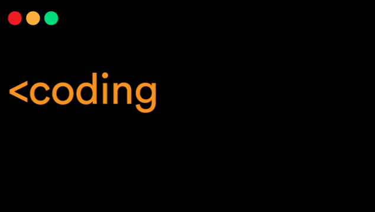

 <!--- src:https://media.giphy.com/media/1sgetPM00wWqJpVUTl/giphy.gif ---->

## Hi, I’m Alsu

### 👩🏻‍💻 About Me :

- 🧑🏻‍🎓 I graduated from Bauman Moscow State Technical University and have a specialist degree

- 💻 Currently studying at School21 in Moscow campus

- 👀 Developer, programmer C/C++

- 📖 Little experience with Java, Spring Boot, REST Service

- ⚡️ Interested in C/C++ development

- 🤓 I like being up-to-date with new technologies, devices, reading tech articles and always studying new things

#### 📫 How to reach me :

<!--- src:https://icons8.com/ ---->

  
  <a href="https://t.me/AlsIbr">@AlsIbr</a>

  
  <a href="mailto:alsouir@mail.ru">alsouir@mail.ru</a>

### 🛠 Languages and Tools :

  &nbsp;
  &nbsp;  
  &nbsp;
  &nbsp;
  &nbsp;
  &nbsp;
  &nbsp;
 
 

